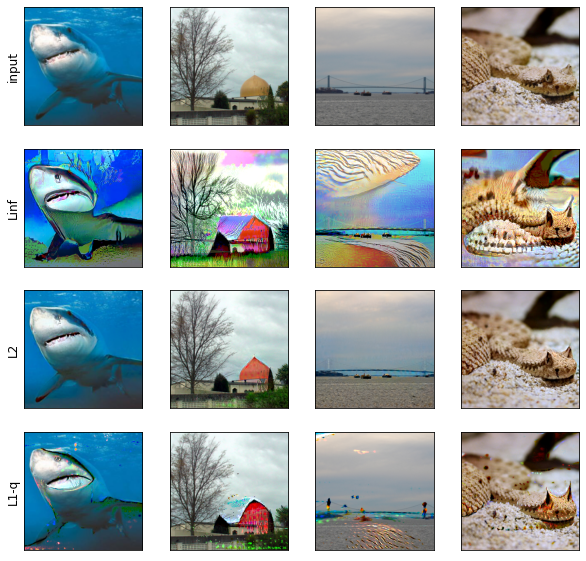
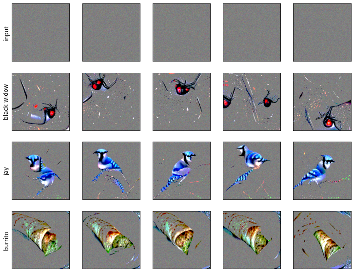
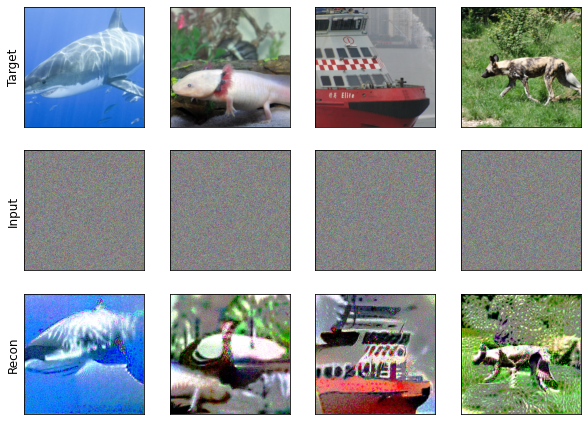

# Controllably Sparse Counter Factuals and Concept Probing

This is the corresponding codebase for the paper: *Controllably Sparse Perturbations of Robust Classifiers for Explaining Predictions and Probing Learned Concepts* published in Eurgraphics Assocition MLVis 2021: [here](https://diglib.eg.org/bitstream/handle/10.2312/mlvis20211072/001-005.pdf).

The method of perturbation based counterfactuals was inspired by the generative properties of adversarially robust CNNs. Our contributions were 

1. Extending the perturbation method to discover concepts learned by the models.
2. Replacing the commong PGD optimizer with a more flexible Frank-Wolfe (FW) based one.
3. Develop a new perturbation method (FW-L1-q) that allows one to generate controllable sparse perturbations which reveal highly localized human aligned features leaned by robust models.

We've added an anaconda `environment.yaml` that has all the package requirements.

# Examples

Details of how to use the algorithm and examples of its output are provided via the notebook: `examples.ipynb`. We provide a resnet class but you will need to download the L2 robust weights from here: https://github.com/MadryLab/robustness.

## Error Explanation

Q: Why did the model mistake one class for another?
A: By perturbing inputs to increase a model's prediction we can visualize features that contributed to the mistake.

## Concept Probing

Q: What features does a model associate with a given class?
A: By providing the model with semantically meaningless images and perturbing them in the direction of a desired class we can find localized features that the model has learned.

##  Custom Loss Functions
We also provide the capability to use custom loss functions to perform other generative tasks. For example we recreate the latent representation inversion from https://github.com/MadryLab/robust_representations/blob/master/image_inversion.ipynb.

